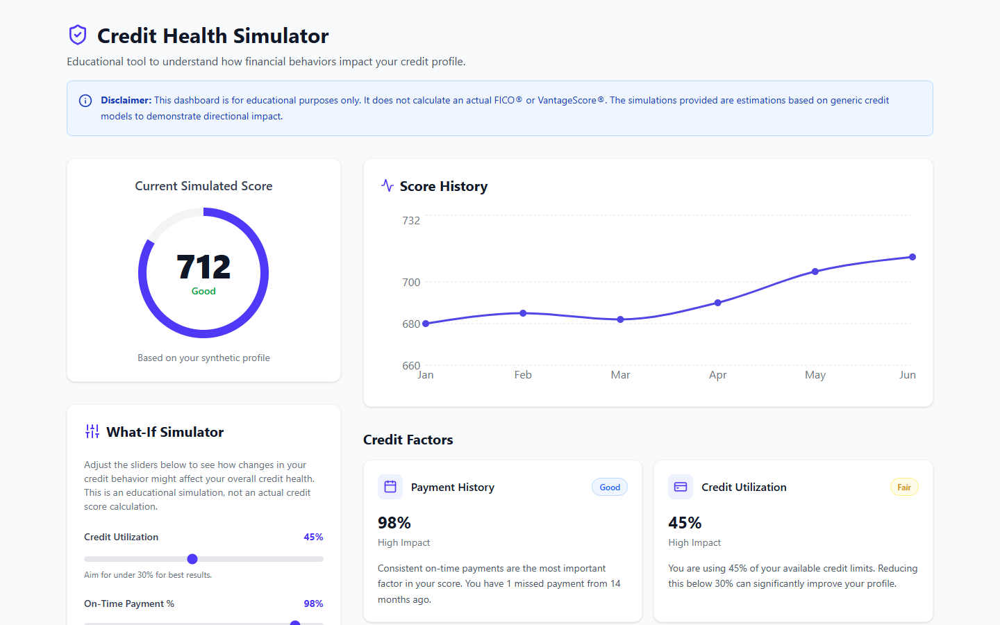

# Credit Health Simulator



## Product Overview
The Credit Health Simulator is an educational FinTech prototype designed to demystify how credit scores work. By visualizing key credit factors—such as payment history, credit utilization, and credit age—users can see the health of a synthetic credit profile. Crucially, the product features a "What-If" simulator that allows users to adjust behaviors (like utilization or on-time payments) to see the potential directional impact on their score. 

**Disclaimer:** This is purely an educational tool. It does not calculate a real FICO® or VantageScore®.

## Why I Built This (Problem Statement)
Many consumers find credit scoring models opaque and confusing. A common question is: "What happens to my score if I pay off my card or if I miss a payment?" Traditional credit reporting apps often show the score but lack interactive educational tools to model future behaviors safely. This project aims to bridge that gap by providing a sandbox environment for credit education.

## Target Users & User Personas
- **Young Professionals / Students:** "Alex" is 22, just got his first credit card, and wants to understand how to build credit fast without making mistakes.
- **Credit Builders / Recoverers:** "Sam" is 35, missed a few payments a year ago, and wants to know the fastest path to repairing her credit for a mortgage application.
- **Financially Curious:** Users who already have decent credit but want to optimize it for the best interest rates.

## Competitive Analysis
- **Credit Karma / Experian:** Offer actual scores and some simulators, but they are tied to real user data and often push credit card offers.
- **Our Simulator:** A purely educational, risk-free sandbox. No PII required, no real credit pull. Focused 100% on learning rather than financial product lead generation.

## Product Goals & KPIs
- **Engagement:** Time spent adjusting sliders in the simulator.
- **Education:** Completion rate of informational tooltips or educational insights read.
- **Retention:** Return visits to check how hypothetical long-term behaviors compound.

## Hypothesis
If users can interactively manipulate credit variables in a simplified UI, their understanding of credit mechanics will improve, reducing anxiety about credit management.

## Key Features & Requirements
1. **Interactive Dashboard:** Visualizes current synthetic score, score history trend.
2. **Factor Breakdown:** Detailed cards explaining Payment History, Utilization, Credit Age, and Inquiries.
3. **What-If Simulator:** Sliders to adjust utilization and payment history, immediately reflecting a simulated score change.
4. **Educational Insights:** Contextual text explaining *why* the score changed.

## User Journey & Workflow
1. User lands on the dashboard and sees the current synthetic score of 712.
2. User reviews the "Credit Factors" to see what is holding the score back (e.g., 45% utilization).
3. User interacts with the "What-If Simulator" slider, dragging utilization down from 45% to 15%.
4. The simulator updates instantly, showing a potential score increase.
5. User reads the educational tooltips to understand the mechanics behind the change.

## User Stories & Acceptance Criteria
- **Story:** As a user, I want to adjust my credit utilization so I can see its impact on my score.
  - **AC:** Simulator includes a utilization slider (0-100%). Changing the slider updates the simulated score in real-time.
- **Story:** As a user, I want to see my score history to understand past trends.
  - **AC:** Dashboard includes a line chart showing 6 months of historical synthetic data.

## What-If Methodology & Assumptions
To provide directional feedback without infringing on proprietary algorithms, this simulator uses a generic ruleset:
- **Utilization:** Base score penalized heavily for >50%, rewarded for <30%.
- **Payment History:** Heavily penalized for anything below 99%, as even one missed payment causes a severe drop.
- **Disclaimer:** The UI explicitly states this is an educational estimation, not a real score.

## Architecture & Tech Stack
- **Frontend Framework:** React 18 with TypeScript.
- **Build Tool:** Vite for fast HMR and optimized builds.
- **Styling:** Tailwind CSS for responsive, utility-first UI design.
- **Icons:** Lucide React for clean, modern iconography.
- **Charting:** Recharts for the score history line chart.
- **State Management:** React Hooks (useState) for the simulator logic.

## UX Decisions & Tradeoffs
- **Tradeoff:** Used simplified, hardcoded logic for the simulator instead of a complex ML model or external API. *Reasoning:* Sufficient for an educational prototype and keeps the app lightweight.
- **UX Decision:** Used a prominent gauge-like SVG for the main score to make it feel like a real FinTech app. Sliders were chosen for the simulator as they provide immediate tactile feedback.

## Roadmap & Future Opportunities
- **Phase 1 (MVP):** Static synthetic data, basic utilization and payment history sliders.
- **Phase 2:** Allow users to input their own baseline numbers (without linking accounts).
- **Phase 3:** Add "Time" as a variable (e.g., "What if I do this for 6 months?").
- **Phase 4:** Gamification, introducing credit-building missions.

---

## Screenshots
*(Note: Screenshots are generated post-build)*
- Dashboard Overview: `screenshots/dashboard.png`
- Simulator Interaction: `screenshots/simulator.png`

---

## Getting Started / Running Locally

### Prerequisites
- Node.js (v16+)
- npm or yarn

### Installation
1. Clone the repository:
   ```bash
   git clone https://github.com/adishuklaa/credit-health-simulator.git
   cd credit-health-simulator
   ```
2. Install dependencies:
   ```bash
   npm install
   ```
3. Run the development server:
   ```bash
   npm run dev
   ```
4. Open `http://localhost:5173` in your browser.

### Environment Variables
No environment variables are required for this prototype.

### Project Structure
```
src/
 ├── components/
 │    ├── Dashboard.tsx       # Main dashboard layout
 │    ├── FactorCard.tsx      # Reusable card for credit factors
 │    └── WhatIfSimulator.tsx # Interactive simulator component
 ├── App.tsx                  # Root component
 └── index.css                # Tailwind directives
```

## Limitations & Future Improvements
- **Accuracy:** The simulation math is intentionally basic. A real product would require actuarial tuning.
- **Accessibility:** Ensure ARIA labels on all sliders for screen readers.

---
